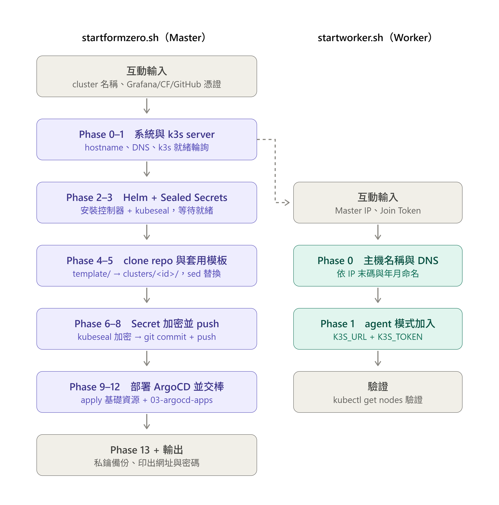
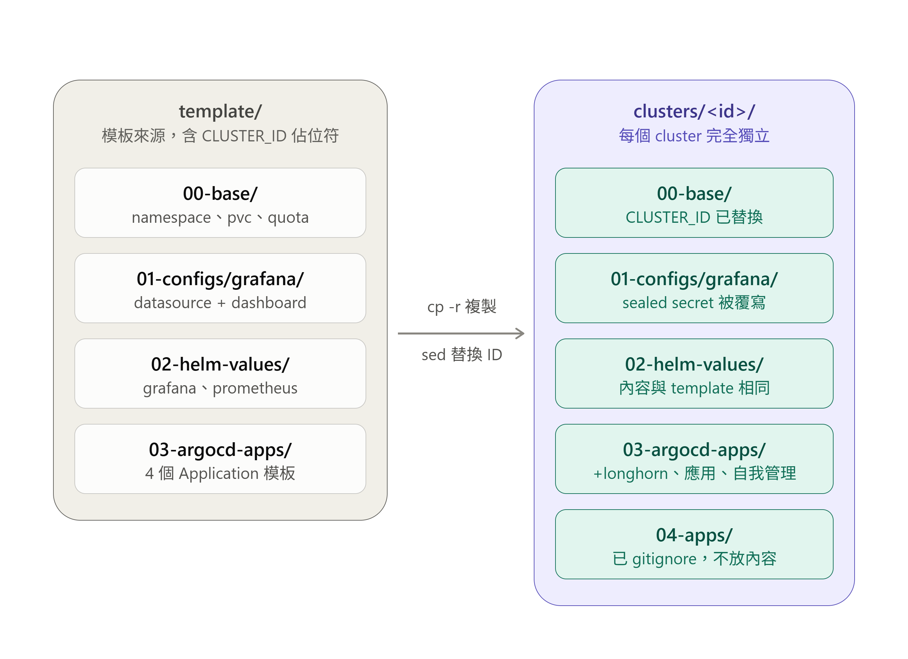
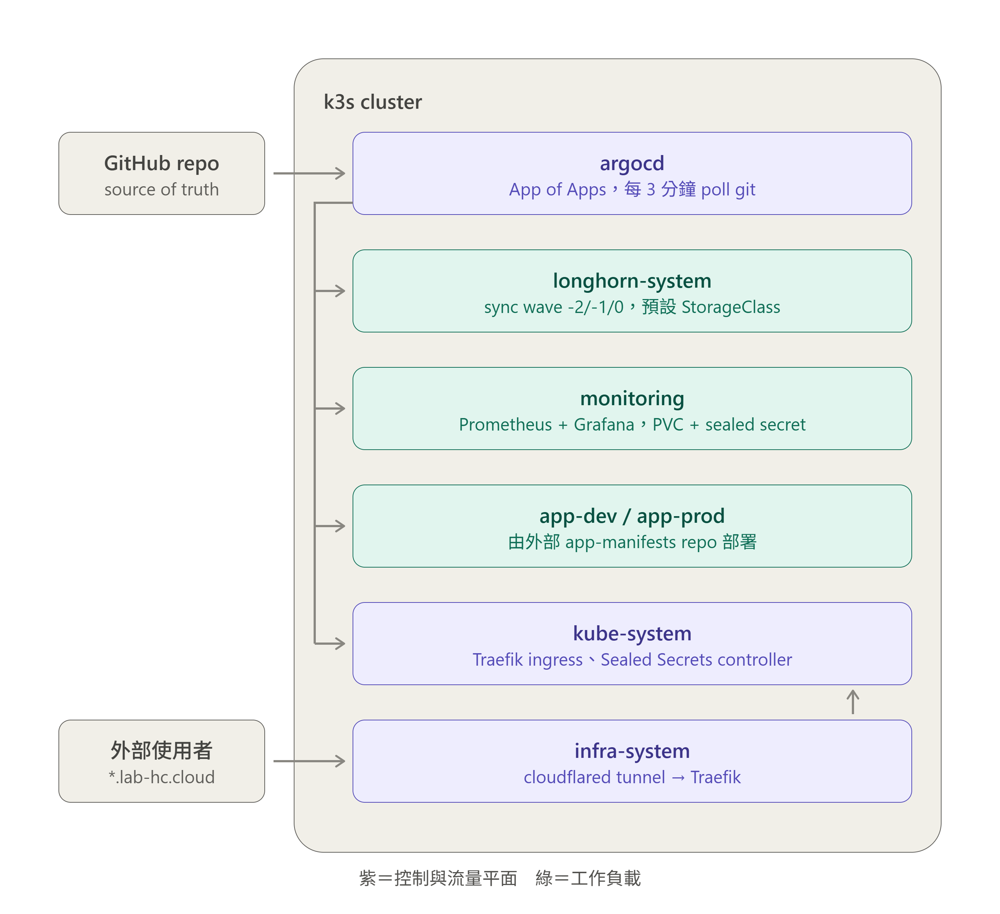

# k3s GitOps Platform

可重複使用的 k3s 平台模組，使用 ArgoCD 自動同步。
提供監控、Secret 管理、對外暴露等基礎設施，應用程式部署於各自的 repo。

## 架構

### 部署流程（startformzero.sh / startworker.sh）
[](template/architecture/gitops_deploy_flow_master_worker.png)

### 目錄結構（template → clusters/<id>）
[](template/architecture/gitops_template_to_clusters_structure.png)

### 執行期架構（GitOps 同步 + namespace 拓樸）
[](template/architecture/gitops_runtime_architecture_namespaces.png)

```
GitHub (source of truth)
    ↓ ArgoCD 每 3 分鐘 poll
k3s cluster
    ├── Cloudflare Tunnel → Traefik → 對外服務
    ├── Longhorn → 分散式持久儲存（跨 node 複製）
    ├── Prometheus + node-exporter + kube-state-metrics
    └── Grafana (dashboard)
```

應用程式（如 MeTube）部署於獨立 repo，透過各自的 ArgoCD Application 指向此 cluster。

## 平台服務網址

| 服務 | 網址 |
|------|------|
| Grafana  | https://grafana.lab-hc.cloud |
| ArgoCD   | https://argocd.lab-hc.cloud  |
| Longhorn | 透過 `kubectl port-forward -n longhorn-system svc/longhorn-frontend 8080:80` 存取 |

## Longhorn 儲存層

Longhorn v1.12.0 不再內建 iscsi-installation DaemonSet，改由自訂 `longhorn-iscsi` Application 處理。

部署順序由 sync-wave 控制：

| Application | Wave | 說明 |
|---|---|---|
| `longhorn-iscsi` | -2 | 自訂 iscsi-installer DaemonSet（Rocky / AlmaLinux / Debian 均支援） |
| `longhorn-prerequisite` | -1 | Longhorn 官方 prerequisite（SELinux workaround、CIFS） |
| `longhorn` | 0 | Longhorn Helm chart（主體） |

首次安裝時 Longhorn Helm pre-upgrade hook 需要 CRD 與 RBAC 存在才能執行，因此改用 `kubectl apply` 官方 manifest（`deploy/longhorn.yaml`）初始化，之後由 ArgoCD 持續管理。

---

## 快速部署

### Master（控制平面）

```bash
git clone https://github.com/hankchi12345/gitops-manifests.git /opt/gitops-manifests
bash /opt/gitops-manifests/startformzero.sh
```

> 若 repo 已存在，每次執行前先 pull 確保 script 是最新版：
> ```bash
> git -C /opt/gitops-manifests pull
> bash /opt/gitops-manifests/startformzero.sh
> ```

Script 會互動式詢問以下資訊，其餘全自動：

| 輸入 | 說明 |
|------|------|
| Cluster name | 自定義名稱（e.g. `m1`, `prod`），script 自動附加 5 碼隨機 ID，例如 `m1-a3k9x` |
| Grafana 帳號 / 密碼 | 輸入明文，script 自動轉 base64 |
| Cloudflare tunnel token | 從 Cloudflare Zero Trust 後台取得，貼上原始 token |
| GitHub username / token | 用於 ArgoCD 連接此 repo（token 需有 `repo` 讀取權限） |

完成後輸出 Cluster ID、ArgoCD 初始密碼與各服務網址。

### Worker（加入現有 cluster）

在 **worker 機器**上執行：

```bash
git clone https://github.com/hankchi12345/gitops-manifests.git /opt/gitops-manifests
bash /opt/gitops-manifests/startworker.sh
```

Script 會互動式詢問以下資訊：

| 輸入 | 說明 |
|------|------|
| Master IP | k3s master 的 IP，例如 `192.168.1.100` |
| Join token | 從 master 取得：`cat /var/lib/rancher/k3s/server/node-token` |

Node name 自動依本機 IP 與時間產生，格式：`k3s-worker-{IP最後一組}-{年2碼}-{月}`。

完成後在 master 執行 `kubectl get nodes` 確認 worker 已加入。

## 目錄結構

```
gitops-manifests/
├── startformzero.sh          # 一鍵部署腳本（master）
├── startworker.sh            # 加入 worker 腳本
├── template/                 # 所有 yaml 模板（不直接部署）
│   ├── 00-base/              # namespace / pvc / quota / cloudflare
│   ├── 01-configs/grafana/   # datasource / dashboard / sealed-secrets
│   ├── 02-helm-values/       # prometheus / grafana helm values
│   └── 03-argocd-apps/       # ArgoCD Application（含 CLUSTER_ID 佔位符）
└── clusters/                 # script 建立，每個 cluster 完全獨立
    └── <cluster-id>/         # 各 cluster 自己的目錄，互不干擾
        ├── 00-base/
        ├── 01-configs/
        ├── 02-helm-values/
        └── 03-argocd-apps/   # ArgoCD app 路徑已替換為此 cluster 的 path
```

應用程式放在各自的 repo，透過 ArgoCD Application 部署到 `clusters/<id>/` 下的 `04-apps/` 目錄（此目錄已加入 `.gitignore`，不進此 repo）。

每個 cluster 的 ArgoCD 只監看自己的 `clusters/<id>/` 目錄，新增其他 cluster 不影響現有 cluster。

## Script 做了什麼

| Phase | 內容 |
|-------|------|
| 0 | 修正 DNS（`/etc/k3s-resolv.conf`，避免 Go 應用解析到 localhost） |
| 1 | 安裝 k3s server，等待 Node Ready |
| 2 | 安裝 Helm，加入 prometheus / grafana / sealed-secrets repo |
| 3 | 安裝 Sealed Secrets controller + kubeseal CLI |
| 4 | Clone / pull repo |
| 5 | 從 `template/` 複製到 `clusters/<cluster-id>/`，替換 ArgoCD app 路徑 |
| 6 | 將輸入的帳密 / token 寫入 `/root/secrets-backup/`（明文，不進 git） |
| 7 | kubeseal 加密，sealed secrets 寫入 `clusters/<cluster-id>/` |
| 8 | git commit + push（ArgoCD 從 git 拉，sealed secrets 必須先進 repo） |
| 9 | apply namespace / PVC / quota / Cloudflare / Grafana kustomize |
| 10 | 安裝 ArgoCD，修正 applicationset-controller 啟動 race condition |
| 11 | 將 GitHub repo 註冊進 ArgoCD |
| 12 | apply ArgoCD Application（之後 ArgoCD 全自動） |
| 13 | 備份 Sealed Secrets 私鑰到 `/root/sealed-secrets-master-key-backup.yaml` |

## 新增應用程式

此 repo 只管平台層。應用程式部署方式：

1. 建立獨立的 app repo（e.g. `app-manifests`）
2. 在 app repo 的 `clusters/<cluster-id>/` 下放 k8s 資源
3. 在此 cluster 上 apply ArgoCD Application，指向 app repo：

```yaml
apiVersion: argoproj.io/v1alpha1
kind: Application
metadata:
  name: my-app
  namespace: argocd
spec:
  project: default
  source:
    repoURL: https://github.com/<user>/app-manifests.git
    targetRevision: HEAD
    path: clusters/<cluster-id>/my-app
  destination:
    server: https://kubernetes.default.svc
    namespace: app-dev
  syncPolicy:
    automated:
      prune: true
      selfHeal: true
```

## 搬到新 Server

Sealed Secrets 私鑰是 cluster-specific。新 server 有兩種情境：

**A. 還原舊私鑰（sealed secrets 不需重新加密）**
```bash
# 先還原私鑰，再跑 script
kubectl apply -f /root/sealed-secrets-master-key-backup.yaml
kubectl rollout restart deployment -n kube-system sealed-secrets
git -C /opt/gitops-manifests pull
bash /opt/gitops-manifests/startformzero.sh
```

**B. 全新 cluster（重新加密，預設做法）**
```bash
git clone https://github.com/hankchi12345/gitops-manifests.git /opt/gitops-manifests
bash /opt/gitops-manifests/startformzero.sh
# script 會用新 cluster 的金鑰重新 seal 並 push 新的 clusters/<id>/ 目錄
```

## 改密碼

```bash
# 1. 修改明文檔案
vi /root/secrets-backup/grafana-secrets.yaml

# 2. 重新 seal（將 CLUSTER_ID 替換為實際值）
kubeseal --format=yaml \
  --controller-name=sealed-secrets \
  --controller-namespace=kube-system \
  < /root/secrets-backup/grafana-secrets.yaml \
  > /opt/gitops-manifests/clusters/<cluster-id>/01-configs/grafana/sealed-secrets.yaml

# 3. git push → ArgoCD 自動 apply

# 4. 刪 PVC 讓 Grafana 重新初始化（密碼存在 DB 裡）
kubectl delete pvc grafana-pvc -n monitoring
```

## 安全備份（重要）

```bash
# Sealed Secrets 私鑰 — cluster 重建時需要
kubectl get secret -n kube-system \
  -l sealedsecrets.bitnami.com/sealed-secrets-key \
  -o yaml > /root/sealed-secrets-master-key-backup.yaml
```

`/root/secrets-backup/` 和 `/root/sealed-secrets-master-key-backup.yaml` 請妥善保存，**不進 git**。
